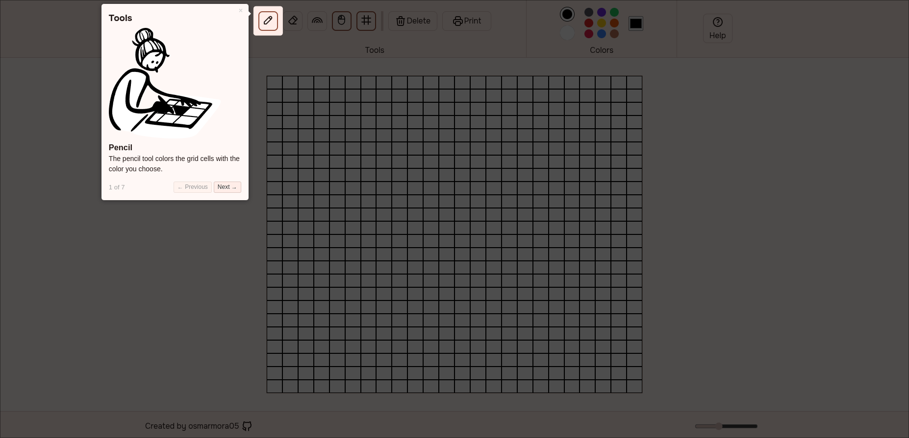

  

  <h1>Pingere</h1>

A minimalist Etch to sketch implementation, inspired a bit by paint, with UI material color palettes.

This project is part of [The Odin Project](https://www.theodinproject.com/lessons/foundations-etch-a-sketch) study plan.

## 📷 Screenshots

## 🚀 Features

- Paints with a specific color, erases the color from the cell you selected, colors with random colors.
- Delete or print (with `jsPDF`) the drawing.
- Select a variety of colors or a custom one.
- Resize the grid while keeping the drawing state.
- A little tour with `driver.js`.

## 📓 Libraries

- [driver.js](https://driverjs.com/)
- [jsPDF](https://github.com/parallax/jsPDF)

## 🖼️Styles

### Icons

- [tabler](https://tabler.io/icons)
- [cocomaterial](https://cocomaterial.com/)

### fonts

- [onest.md](https://onest.md/)
- [Pacifico](https://fonts.google.com/specimen/Pacifico)

## 🎮 Demo

- [Live demo here!]()

## 🛠️Tech Stack

- HTML
- CSS
- JavaScript
- Git
- Penpot

> [!Note]
> I use the `CSS anchor positioning API` for tooltip positioning. This feature, at the time of publishing this project, doesn't work in all browsers. [See support](https://caniuse.com/?search=anchor-name).

## ⚖️ License

MIT
